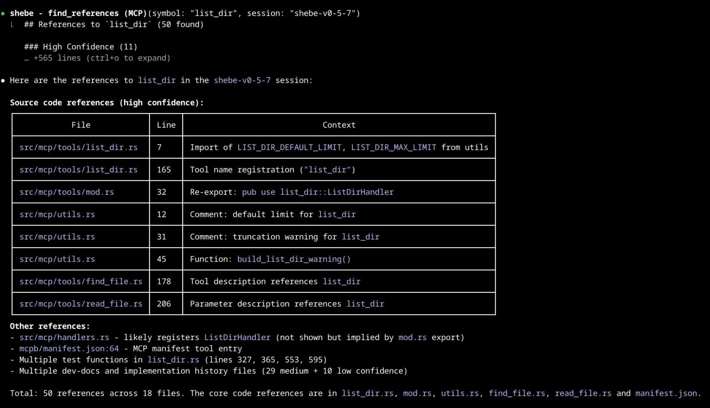
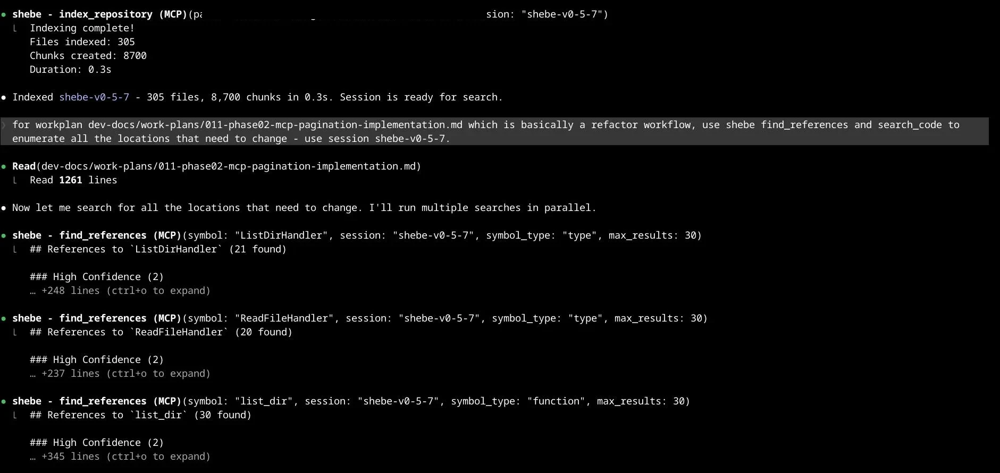
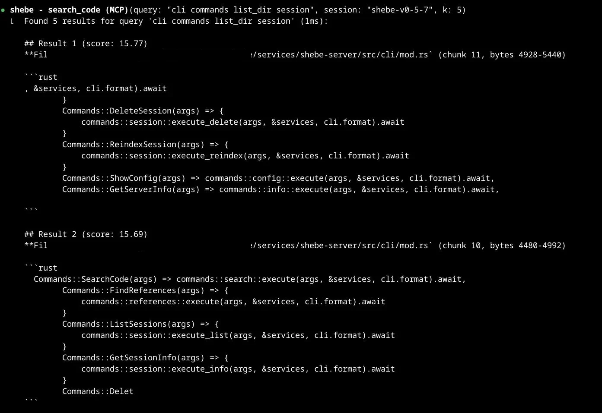
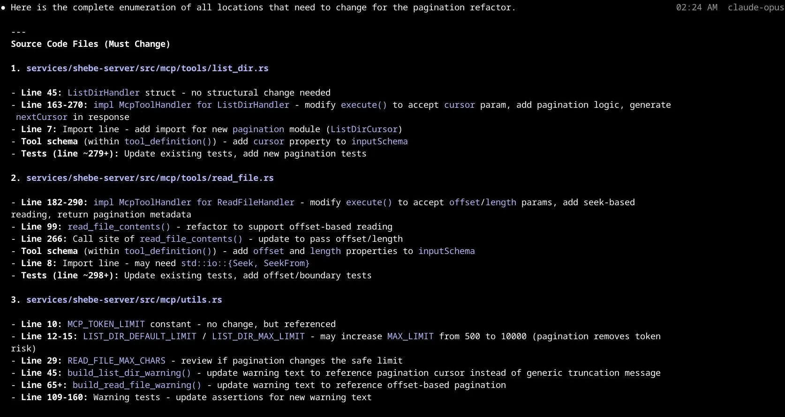
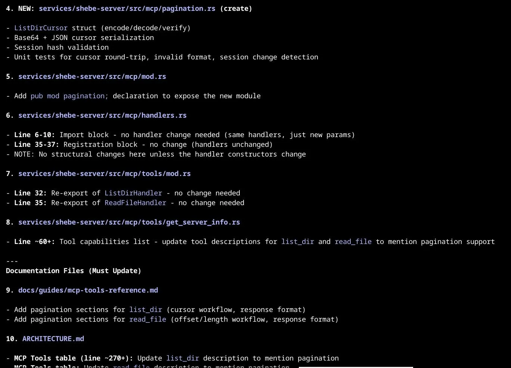
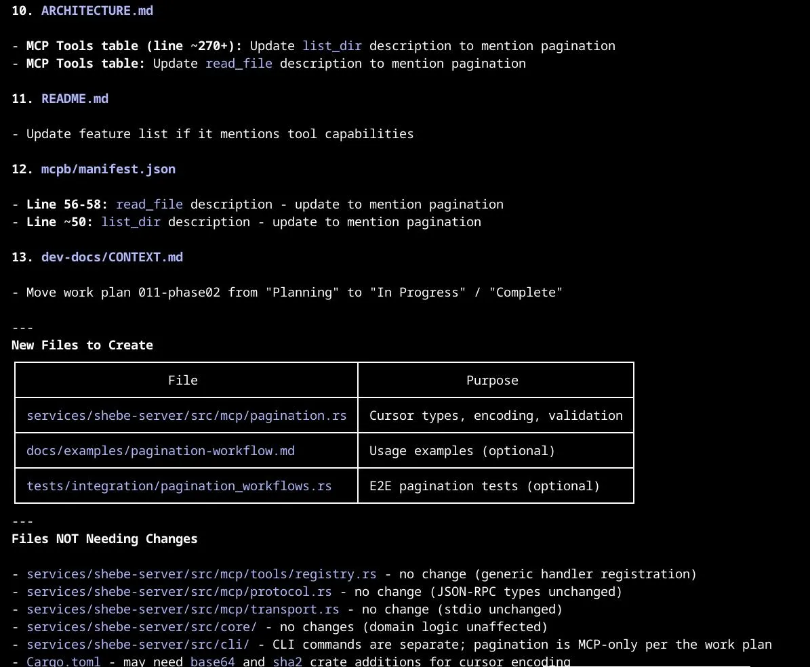

# Shebe

[](https://gitlab.com/rhobimd-oss/shebe/-/commits/main) [](https://gitlab.com/rhobimd-oss/shebe/-/commits/main) [](https://gitlab.com/rhobimd-oss/shebe/-/releases)



**Fast Code Search via BM25**

Shebe is a fast and simple local code-search tool powered by BM25. No embeddings, 
No GPU, No cloud.

Research shows [70-85% of developer code search][research-1] value comes from
keyword-based queries. Developers search with exact terms they know:
function names, API calls, error messages. [BM25 excels at this][research-2].

**Trade-offs:**
- Repositories must be cloned locally before indexing (no remote URL support)
- No semantic similarity: "login" does not match "authenticate". However, BM25
  supports multi-term queries without performance degradation - agents quickly
  learn to include synonyms (e.g., `login OR authenticate OR sign-in`). For true
  semantic search, pair with vector tools. See [detailed analysis][bm25-analysis].


**Capabilities:**
  - 2ms query latency
  - 2k-12k files/sec indexing (6k files in 0.5s)
  - 200-700 tokens/query
  - Full UTF-8 support (emoji, CJK, special characters)
  - 14 MCP tools for coding agents (claude, codex etc) ([reference](./docs/guides/mcp-tools-reference.md))

**Size:**
  - ~10k lines of Rust source code (and another ~10k LoC test code). 
  - 2 binaries (cli and mcp) each at ~8MB.

**Positioning:**
Complements structural tools (Serena MCP) with content search. Coding agents learn
tool selection quickly:
- **grep/ripgrep** - Exact regex patterns, exhaustive matches, small codebases
- **Shebe** - Ranked results, large codebases (1k+ files), polyglot search, boolean queries
- **Serena** - Symbol refactoring, AST-aware edits, type-safe renaming

**Alternatives:**
Cloud solutions like [turbopuffer][] and [nia][] come at a premium.
Shebe is a free, local-only alternative. See [WHY_SHEBE.md](./WHY_SHEBE.md)
for benchmarks.


[tantivy]: https://github.com/quickwit-oss/tantivy
[research-1]: https://research.google/pubs/how-developers-search-for-code-a-case-study/
[research-2]: https://sourcegraph.com/blog/keeping-it-boring-and-relevant-with-bm25f
[bm25-analysis]: ./docs/analyses/018-bm25-vs-vector-code-search-01.md
[nia]: https://www.trynia.ai/#pricing
[turbopuffer]: https://turbopuffer.com/pricing


## Table of Contents

- [Quick Start](#quick-start)
- [Common Tasks](#common-tasks)
- [Refactoring Workflow](#refactoring-workflow)
- [Configuration](#configuration)
- [Documentation](#documentation)
- [Performance](#performance)
- [Architecture](#architecture)
- [Troubleshooting](#troubleshooting)
- [Project Status](#project-status)
- [License](#license)
- [Contributing](#contributing)


---

## Quick Start

### 1. Install

**Homebrew (macOS and Linux):**

```bash
brew tap rhobimd-oss/shebe-releases \
  https://github.com/rhobimd-oss/shebe-releases
brew install shebe
```

**Manual download (Linux x86_64):**

```bash
export SHEBE_VERSION=0.5.7
curl -LO "https://github.com/rhobimd-oss/shebe-releases/releases/download/v${SHEBE_VERSION}/shebe-v${SHEBE_VERSION}-linux-x86_64.tar.gz"
tar -xzf shebe-v${SHEBE_VERSION}-linux-x86_64.tar.gz
sudo mv shebe shebe-mcp /usr/local/bin/
```

**Verify:**

```bash
shebe --version
```

### 2. Index a Repository

```bash
# Clone a test repository
git clone --depth 1 https://github.com/envoyproxy/envoy.git ~/envoy

# Index it (creates session "envoy-v1")
shebe index-repository ~/envoy envoy-v1
# Output: Indexed 8,234 files (12,847 chunks) in 2.1s
```

### 3. Search Code

```bash
# Search for access log formatting
shebe search-code envoy-v1 "accesslog format"
```

```
Results for "accesslog format" in envoy-v1 (top 10):

1. source/extensions/access_loggers/common/access_log_base.h [0.847]
   class AccessLogBase : public AccessLog::Instance {
     void formatAccessLog(...);

2. source/common/formatter/substitution_formatter.cc [0.823]
   SubstitutionFormatter::format(const StreamInfo& info) {
```

### 4. Find References

```bash
# Find all references to SubstitutionFormatter
shebe find-references envoy-v1 SubstitutionFormatter --symbol-type type
```

```
References to "SubstitutionFormatter" (type) - 23 found:

HIGH CONFIDENCE (18):
  source/common/formatter/substitution_formatter.h:45
    class SubstitutionFormatter : public Formatter {

  source/extensions/access_loggers/file/file_access_log.cc:28
    std::unique_ptr<SubstitutionFormatter> formatter_;
  ...
```

For detailed setup, see [INSTALLATION.md](./INSTALLATION.md).

---

## Common Tasks

Quick links to accomplish specific goals:

| Task                     | Tool                               | Guide                                                                  |
|--------------------------|------------------------------------|------------------------------------------------------------------------|
| Rename a symbol safely   | `find_references`                  | [Reference](./docs/guides/mcp-tools-reference.md#tool-find_references) |
| Search polyglot codebase | `search_code`                      | [Reference](./docs/guides/mcp-tools-reference.md#tool-search_code)     |
| Explore unfamiliar repo  | `index_repository` + `search_code` | [Quick Start](./docs/guides/mcp-quick-start.md)                        |
| Find files by pattern    | `find_file`                        | [Reference](./docs/guides/mcp-tools-reference.md#tool-find_file)       |
| View file with context   | `read_file` or `preview_chunk`     | [Reference](./docs/guides/mcp-tools-reference.md#tool-read_file)       |
| Update stale index       | `reindex_session`                  | [Reference](./docs/guides/mcp-tools-reference.md#tool-reindex_session) |

### Refactoring Workflow

Shebe's `find_references` and `search_code` tools work together to enumerate
all code locations affected by a refactoring task. In this example, Claude Code
uses Shebe to analyze a pagination work plan and identify every file that needs
to change -- completing the full impact analysis in ~1 minute.

<details>
<summary>View full workflow (6 screenshots)</summary>

**Step 1: Index repository and run parallel find_references**



**Step 2: search_code locates CLI routing code**



**Step 3: Structured analysis -- source files needing changes**



**Step 4: New modules, wiring and documentation**



**Step 5: File creation plan and exclusion list**



**Step 6: Impact summary (~11 files, 1m 14s)**


</details>

---

## Configuration

### Quick Reference

| Variable           | Default                | Description                                  |
|--------------------|------------------------|----------------------------------------------|
| `SHEBE_INDEX_DIR`  | `~/.local/state/shebe` | Session storage location                     |
| `SHEBE_CHUNK_SIZE` | `512`                  | Characters per chunk (100-2000)              |
| `SHEBE_OVERLAP`    | `64`                   | Overlap between chunks                       |
| `SHEBE_DEFAULT_K`  | `10`                   | Default search results count                 |
| `SHEBE_MAX_K`      | `100`                  | Maximum search results allowed               |

### Configuration File

Create `shebe.toml` in your working directory or `~/.config/shebe/shebe.toml`:

```toml
[indexing]
chunk_size = 512
overlap = 64
max_file_size = 10485760  # 10MB

[search]
default_k = 10
max_k = 100
```

See [CONFIGURATION.md](./CONFIGURATION.md) for complete reference.

---

## Documentation

### Getting Started
- **[INSTALLATION.md](./INSTALLATION.md)** - Installation and setup guide
- **[Quick Start Guide](./docs/guides/mcp-quick-start.md)** - 5-minute setup for Claude Code

### Reference
- **[MCP Tools Reference](./docs/guides/mcp-tools-reference.md)** - Complete API for all 14 tools
- **[CONFIGURATION.md](./CONFIGURATION.md)** - All configuration options
- **[Performance Benchmarks](./docs/Performance.md)** - Detailed performance data

### Development
- **[ARCHITECTURE.md](./ARCHITECTURE.md)** - Developer guide (where/how to change code)
- **[CONTRIBUTING.md](./CONTRIBUTING.md)** - How to contribute
- **[CODE_OF_CONDUCT.md](./CODE_OF_CONDUCT.md)** - Community guidelines
- **[SECURITY.md](./SECURITY.md)** - Security policy and reporting

---

## Performance

**Validated on Istio (5,605 files, Go-heavy) and OpenEMR (6,364 files, PHP polyglot):**

| Metric             | Result                                           |
|--------------------|--------------------------------------------------|
| Query latency      | **2ms** (consistent across all query types)      |
| Indexing (Istio)   | **11,210 files/sec** (0.5s for 5,605 files)      |
| Indexing (OpenEMR) | **1,928 files/sec** (3.3s for 6,364 files)       |
| Token usage        | **210-650** tokens/query                         |
| Polyglot coverage  | **11 file types** in single query                |

See [docs/Performance.md](./docs/Performance.md) for detailed benchmarks.

---

## Architecture

See [ARCHITECTURE.md](./ARCHITECTURE.md) for developer guide.

---

## Troubleshooting

| Issue                         | Cause                            | Solution                                           |
|-------------------------------|----------------------------------|----------------------------------------------------|
| "Session not found"           | Session doesn't exist or typo    | Run `list_sessions` to see available sessions      |
| "Schema version mismatch"     | Session from older Shebe version | Run `upgrade_session` to migrate                   |
| Slow indexing                 | Disk I/O or large files          | Exclude `node_modules/`, `target/`, check disk     |
| No search results             | Empty session or wrong query     | Verify with `get_session_info`, check query syntax |
| "File not found" in read_file | File deleted since indexing      | Run `reindex_session` to update                    |
| High token usage              | Too many results                 | Reduce `k` parameter (default: 10)                 |

For detailed troubleshooting, see [docs/guides/mcp-setup-guide.md](./docs/guides/mcp-setup-guide.md).

---

## Project Status

**Version:** v0.5.X  
**Status:** Release Candidate  
**Testing:** 76% coverage  
**Next:** Pagination for `list_dir` and `read_file` when more than 500 files match a search term

See [CHANGELOG.md](./CHANGELOG.md) for version history.

---

## License

See [LICENSE](./LICENSE).

---

## Contributing

We welcome contributions! Please see [CONTRIBUTING.md](./CONTRIBUTING.md) for detailed guidelines.
